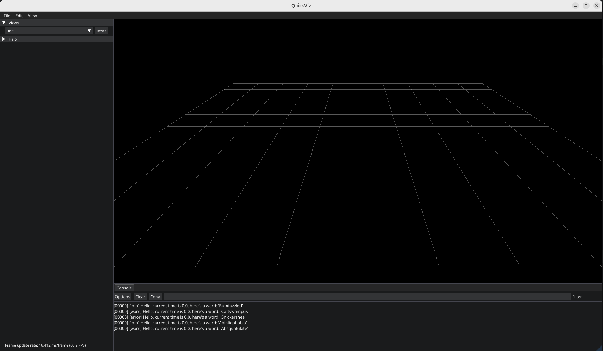
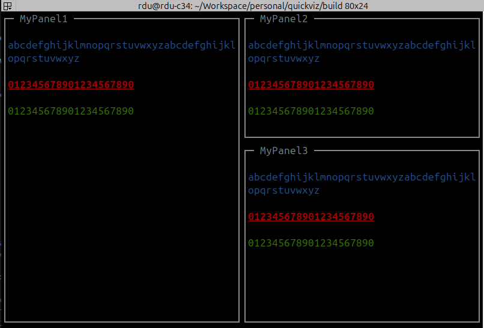

# QuickViz


This repository provides a collection of C++ libraries for creating data visualization and basic UI applications, primarily focused on use cases in robotics.

The core component of this codebase is a library called "imview", which is designed to be both flexible and lightweight:

* For data visualization, imview provides a set of API functions to easily plot 2D time-series data, draw 2D primitives
  and render 3D objects in real-time.
* For UI design, imview includes automatic layout management and widgets such as buttons, sliders, and text boxes.

The design of imview is documented in [docs/imview_design.md](docs/imview_design.md). If you are interested in using the imview library in your 
own project, it's recommended to read this design document first. Additionally, an app named "quickviz" is included with commonly used 
data visualization functions (to support development of [libxmotion](https://github.com/rxdu/libxmotion)). It also serves as an example to demonstrate 
the usage of the imview library.

## Build

### Linux

The code in this repository should build on any recent linux distributions with a compiler supporting C++11/14/17. Note
that the yoga library for layout management requires certain C++20 features, and you will need to disable automatic
layout feature if you are using an older compiler (such as the gcc that comes with Ubuntu 20.04 or older).

**Setup toolchain**

```
$ sudo apt install build-essential cmake
```

If the version of cmake bundled with your system is too low, you can install a newer version
from [Kitware PPA](https://apt.kitware.com/) or build and install from [source](https://cmake.org/download/).

**Install dependencies**

```
$ sudo apt-get install libgl1-mesa-dev libglfw3-dev libcairo2-dev
```

Please refer to [CI configuration](.github/workflows/default.yml) for the up-to-date dependency installation
instructions.

**Download code**

```
$ git clone --recursive https://github.com/rxdu/quickviz.git
```

Or you can clone and then update the submodules manually

```
$ git clone https://github.com/rxdu/quickviz.git
$ cd quickviz
$ git submodule update --init --recursive
```

**Configure CMake and compile**

```
$ cd quickviz
$ mkdir build && cd build
$ cmake ..
$ make -j8
```

### Windows

(Windows support is experimental and may not be as stable as the Linux setup.)

On Windows, vcpkg is used to manage dependencies. The following instructions are tested on Windows 11 with Visual Studio 2022.

**Setup toolchain**

* Install Visual Studio (MinGW is not tested and may not work)
* Install [git](https://gitforwindows.org/)
* Install [cmake](https://cmake.org/download/)

Make sure both git and cmake are added to the system PATH. This should be done automatically for you if you use an installer 
with default installation settings. Otherwise, you can add the paths manually if you prefer installing them with binary archives.

**Install vcpkg**

Refer to the [vcpkg documentation](https://learn.microsoft.com/en-us/vcpkg/get_started/get-started?pivots=shell-bash) for more details.

```
$ git clone https://github.com/microsoft/vcpkg.git
$ cd vcpkg
$ .\bootstrap-vcpkg.bat # if you are using powershell
```

Make sure the following two environment variables are set:

```
export VCPKG_ROOT=/path/to/vcpkg
export PATH=$VCPKG_ROOT:$PATH
```

You can add the two variables in "Environment Variables" in Windows settings to make them persistent. Note that you should use
`%VCPKG_ROOT%` instead of `$VCPKG_ROOT` when appending it to the PATH variable.

**Build package**

Depending on the IDE you use, the configuration steps may vary.

For Visual Studio, open "Build"-"Cmake Settings for quickfiz" and add the following line to "CMake command arguments":

```
-DCMAKE_TOOLCHAIN_FILE=<your-vcpkg-path>/scripts/buildsystems/vcpkg.cmake
```

Then you should be able to configure and build the project successfully.

## Sample Applications

A GUI-based application that demonstrates the usage of the imview library.



A terminal-based application that demonstrates the terminal support of the imview library.



## Reference

The library is built on top of a few third-party libraries, you can refer to their documentation for more details:

* imgui demo: src/third_party/imcore/imgui/imgui_demo.cpp
* implot demo: src/third_party/imcore/implot/implot_demo.cpp
* cairo docs: https://cairographics.org/documentation/
* yoga layout docs: https://www.yogalayout.dev/docs/styling/

Online demo of imgui and implot:

* [imgui demo](https://greggman.github.io/doodles/glfw-imgui/out/glfw-imgui.html)
* [implot demo](https://traineq.org/implot_demo/src/implot_demo.html)
