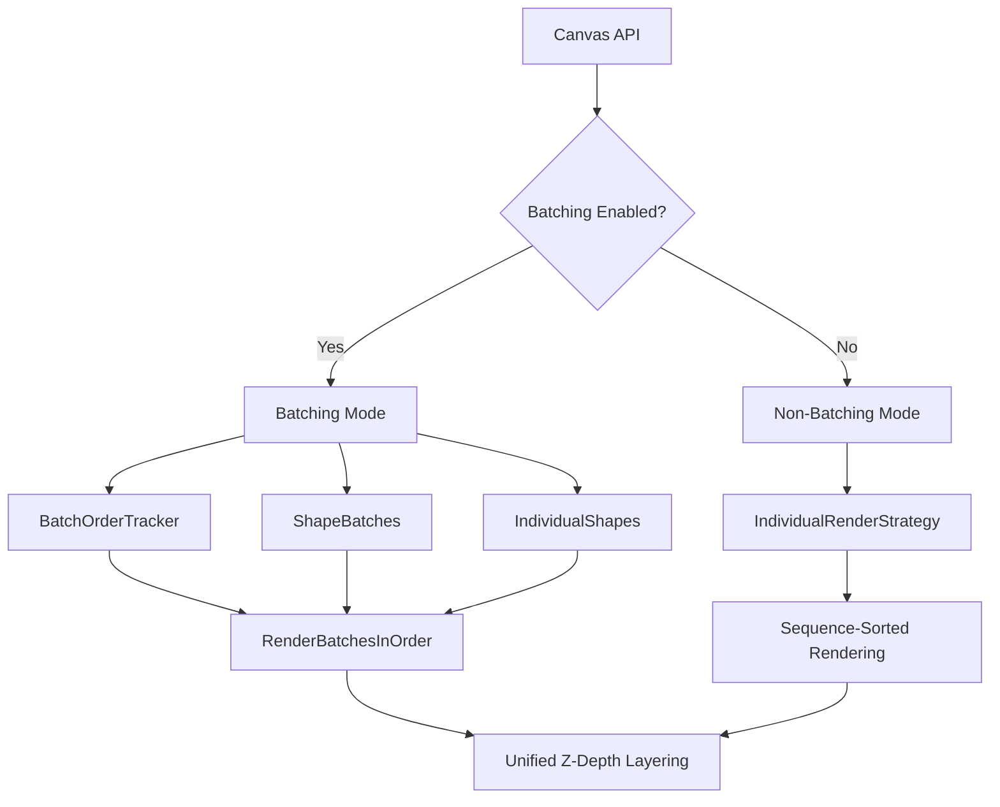

# Canvas Batching Architecture Documentation

## Overview

The Canvas rendering system supports two distinct rendering modes designed to optimize performance while maintaining consistent drawing order across all primitive types. This document explains how batching mode and non-batching mode work, how sequence numbers are managed, and how Z-depth layering is implemented.

## Architecture Overview



## Rendering Modes

### Batching Mode (`batching_enabled = true`)

**Purpose**: Optimize performance by grouping similar primitives into batches while maintaining correct drawing order.

**Key Components**:
- `BatchOrderTracker`: Maintains global sequence order across all primitive types
- `ShapeBatch`: Groups similar shapes (circles, rectangles) for efficient GPU rendering
- `IndividualRenderStrategy`: Handles complex shapes (polygons, ellipses) that don't batch well

**Rendering Flow**:
1. Primitives are added to appropriate batches or individual collections
2. Each primitive gets a sequence number from `BatchOrderTracker`
3. `RenderBatchesInOrder()` renders all primitives in sequence order
4. Batched shapes use index ranges for selective rendering
5. Individual shapes are rendered at their specific sequence positions

### Non-Batching Mode (`batching_enabled = false`)

**Purpose**: Simple, direct rendering with guaranteed order but potentially lower performance.

**Key Components**:
- `IndividualRenderStrategy`: Handles all primitive types individually
- Direct sequence-based sorting and rendering

**Rendering Flow**:
1. All primitives stored in `CanvasData` collections
2. `IndividualRenderStrategy` sorts all primitives by sequence number
3. Renders each primitive individually in sequence order

## Sequence Number Management

### Unified Sequence Counter

Both modes use a **unified sequence numbering system** to ensure consistent ordering:

```cpp
// Global sequence counter (used by both modes)
BatchOrderTracker::next_sequence = 0;
CanvasData::next_sequence_number = 0;

// Sequence assignment
uint32_t sequence = batch_order_tracker_.GetNextSequence();
```

### Critical Sequence Synchronization

In batching mode, sequence numbers must be synchronized between the batch order tracker and individual shapes:

```cpp
// BEFORE FIX: Sequence mismatch
uint32_t batch_sequence = batch_order_tracker_.GetNextSequence(); // e.g., 10
data_->AddPolygon(...); // Assigns internal sequence = 5
// Z-depth calculated with sequence 5, but batch expects sequence 10

// AFTER FIX: Sequence synchronization  
uint32_t sequence = batch_order_tracker_.GetNextSequence(); // e.g., 10
data_->AddPolygon(...);
data_->polygons.back().sequence_number = sequence; // Override to 10
// Z-depth and batch order both use sequence 10
```

## Z-Depth Assignment Strategy

### Z-Depth Formula

All modes use the same Z-depth calculation for consistent layering:

```cpp
float z_depth = sequence_number * 0.001f;
```

**Rationale**:
- **0.001f increment**: Provides sufficient separation between layers
- **Sequence-based**: Higher sequence numbers = higher Z values = rendered on top
- **Consistent**: Same formula across all primitive types and rendering modes

### Z-Depth Application by Primitive Type

#### Batched Shapes (Circles, Rectangles)
```cpp
// In GenerateCircleVertices() and GenerateRectangleVertices()
float z_depth = sequence_number * 0.001f;
vertices.insert(vertices.end(), {x, y, z_depth});
```

#### Individual Shapes (Polygons)
```cpp
// In ShapeGenerators::GeneratePolygonVertices()
float z_depth = polygon.sequence_number * 0.001f;
for (const auto& vertex : polygon.vertices) {
    vertices.insert(vertices.end(), {vertex.x, vertex.y, z_depth});
}
```

#### Individual Shapes (Ellipses)
```cpp
// In ShapeGenerators::GenerateEllipseVertices()
float z_depth = ellipse.sequence_number * 0.001f;
glm::vec3 center_with_depth = {ellipse.center.x, ellipse.center.y, z_depth};
return GeometryUtils::CreateEllipse(center_with_depth, ...);
```

## Batching Mode Deep Dive

### Primitive Classification

Primitives are classified into categories for optimal batching:

| Primitive Type | Batching Strategy | Storage | Rendering Method |
|----------------|-------------------|---------|------------------|
| Points | Individual | `CanvasData::points` | Direct rendering |
| Lines | Batched by LineType | `line_batches_[line_type]` | Batch rendering |
| Rectangles | Batched (filled/outline) | `filled_shape_batch_` / `outline_shape_batches_` | Index range rendering |
| Circles | Batched (filled/outline) | `filled_shape_batch_` / `outline_shape_batches_` | Index range rendering |
| Ellipses | Individual | `CanvasData::ellipses` | Individual rendering |
| Polygons | Individual | `CanvasData::polygons` | Individual rendering |

### Batch Order Tracking

The `BatchOrderTracker` maintains a unified sequence across all primitive types:

```cpp
struct OrderedPrimitive {
    enum class Type {
        kLine,           // Batched lines
        kFilledShape,    // Batched filled shapes (circles, rectangles)
        kOutlineShape,   // Batched outline shapes
        kIndividualShape // Individual shapes (polygons, ellipses)
    };
    
    Type type;
    LineType line_type;              // For lines and outlines
    uint32_t sequence_number;        // Global sequence
    uint32_t batch_index;            // Index within batch or shape index
    IndividualShapeType individual_shape_type; // For individual shapes
};
```

### Unified Rendering in RenderBatchesInOrder()

```cpp
void Canvas::RenderBatchesInOrder() {
    // Sort all primitives by sequence number
    std::sort(sorted_order.begin(), sorted_order.end(),
              [](const auto& a, const auto& b) { 
                  return a.sequence_number < b.sequence_number; 
              });
    
    // Render each primitive type at its sequence position
    for (const auto& primitive : sorted_order) {
        switch (primitive.type) {
            case Type::kLine:
                // Render specific line from batch
                glDrawArrays(GL_LINES, primitive.batch_index * 2, 2);
                break;
                
            case Type::kFilledShape:
                // Render specific shape using index range
                const auto& range = filled_shape_batch_.index_ranges[primitive.batch_index];
                glDrawElements(GL_TRIANGLES, range.count, GL_UNSIGNED_INT, ...);
                break;
                
            case Type::kIndividualShape:
                // Render specific individual shape
                if (primitive.individual_shape_type == IndividualShapeType::kPolygon) {
                    RenderSinglePolygon(data.polygons[primitive.batch_index], context);
                }
                break;
        }
    }
}
```

## Non-Batching Mode Deep Dive

### Simple Sequential Rendering

Non-batching mode uses a straightforward approach:

```cpp
void IndividualRenderStrategy::Render(const CanvasData& data, const RenderContext& context) {
    // Collect all primitives with sequence numbers
    std::vector<PrimitiveRef> sorted_primitives;
    
    // Add all primitive types to the sorted list
    for (size_t i = 0; i < data.circles.size(); ++i) {
        sorted_primitives.push_back({PrimitiveType::kCircle, i, data.circles[i].sequence_number});
    }
    // ... (repeat for all primitive types)
    
    // Sort by sequence number
    std::sort(sorted_primitives.begin(), sorted_primitives.end(),
              [](const PrimitiveRef& a, const PrimitiveRef& b) {
                  return a.sequence_number < b.sequence_number;
              });
    
    // Render each primitive individually
    for (const auto& primitive_ref : sorted_primitives) {
        switch (primitive_ref.type) {
            case PrimitiveType::kCircle:
                RenderSingleCircle(data.circles[primitive_ref.index], context);
                break;
            // ... (handle all primitive types)
        }
    }
}
```

## OpenGL State Management

### Depth Testing Configuration

Both modes use identical OpenGL depth testing:

```cpp
// Enable depth testing for proper layering
glEnable(GL_DEPTH_TEST);
glDepthFunc(GL_LEQUAL);  // Later primitives (higher Z) draw on top

// Enable alpha blending for transparency
glEnable(GL_BLEND);
glBlendFunc(GL_SRC_ALPHA, GL_ONE_MINUS_SRC_ALPHA);
```

### Depth Buffer Range

- **Z-Near**: 0.0f (background elements)
- **Z-Far**: Determined by highest sequence number × 0.001f
- **Typical Range**: 0.000f to ~0.100f for 100 primitives

## Performance Characteristics

### Batching Mode Performance

**Advantages**:
- **GPU Efficiency**: Fewer draw calls through batching
- **Memory Locality**: Grouped vertices and indices
- **Selective Rendering**: Only renders specific shapes from batches

**Trade-offs**:
- **Memory Overhead**: Batch management structures
- **Complexity**: Unified sequence tracking

### Non-Batching Mode Performance  

**Advantages**:
- **Simplicity**: Straightforward rendering logic
- **Predictability**: Direct sequence-based rendering

**Trade-offs**:
- **Draw Call Overhead**: One draw call per primitive
- **GPU Utilization**: Less efficient batching

## Usage Guidelines

### When to Use Batching Mode

✅ **Recommended for**:
- Applications with many similar primitives (circles, rectangles, lines)
- Real-time applications requiring high performance
- Scenes with mixed primitive types requiring strict ordering

### When to Use Non-Batching Mode

✅ **Recommended for**:
- Simple applications with few primitives
- Debug/development scenarios requiring predictable rendering
- Applications where simplicity is more important than performance

## Example: Rendering Order Verification

Given this sequence of operations:

```cpp
canvas->AddCircle(1.0f, 2.0f, 0.7f, red, true);      // Sequence 0, Z = 0.000f
canvas->AddCircle(2.0f, 2.0f, 0.7f, green, true);    // Sequence 1, Z = 0.001f  
canvas->AddCircle(3.0f, 2.0f, 0.7f, blue, true);     // Sequence 2, Z = 0.002f
canvas->AddEllipse(0.0f, 3.0f, 1.0f, 0.5f, olive);   // Sequence 3, Z = 0.003f
canvas->AddPolygon(star_vertices, gold, true);        // Sequence 4, Z = 0.004f
```

**Expected Rendering Order** (bottom to top):
1. Red circle (background)
2. Green circle  
3. Blue circle
4. Olive ellipse
5. Gold star polygon (foreground)

**Both modes guarantee this ordering through**:
- Unified sequence numbering
- Consistent Z-depth calculation  
- Proper depth testing configuration

## Troubleshooting Common Issues

### Issue: Shapes Rendering in Wrong Order

**Symptoms**: Later-added shapes appear behind earlier ones

**Likely Causes**:
1. Sequence number mismatch between batch tracker and shape data
2. Incorrect Z-depth calculation
3. Disabled depth testing

**Solution**: Verify sequence synchronization in batching mode

### Issue: Performance Problems

**Symptoms**: Low frame rates with many primitives

**Likely Causes**:
1. Using non-batching mode with many similar primitives
2. Inefficient batch management

**Solution**: Switch to batching mode and verify batch grouping

### Issue: Transparency Issues

**Symptoms**: Transparent shapes not blending correctly

**Likely Causes**:
1. Incorrect depth function (GL_LESS instead of GL_LEQUAL)
2. Missing alpha blending setup

**Solution**: Verify OpenGL blending configuration

## Future Enhancements

### Potential Optimizations

1. **Dynamic Batching**: Automatically choose batching strategy based on primitive distribution
2. **Spatial Batching**: Group primitives by spatial locality for better cache performance
3. **Multi-threaded Processing**: Parallel batch generation for large datasets
4. **GPU-based Sorting**: Utilize compute shaders for sequence sorting

### API Improvements

1. **Batch Hints**: Allow applications to hint optimal batching strategies
2. **Performance Metrics**: Expose batch efficiency statistics
3. **Memory Management**: Configurable batch size limits and memory pools