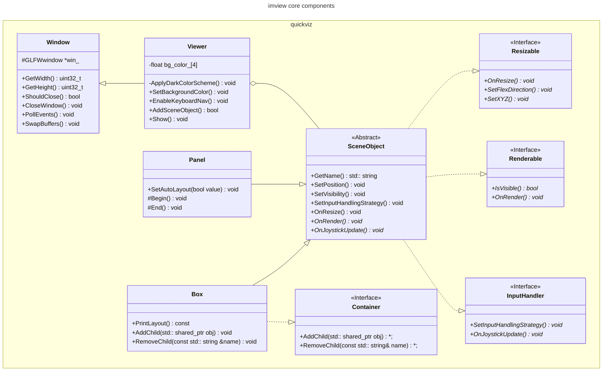
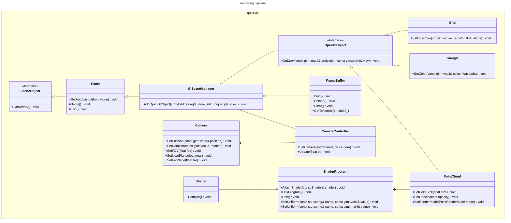

# ImView Design

imview is designed to be a flexible and lightweight framework for 2 types of applications:

* 2D/3D data visualization
* GUI applications

For data visualization, imview provides a set of API functions to easily plot 2D time-series data, draw 2D primitives
and render 3D objects. It can be used to visualize data in real-time.

For GUI applications, imview provides automatic layout management and commonly used UI widgets such as buttons, sliders,
and text boxes.

## Implementation

### Core Components

* **Window management**: imview uses GLFW for window management. GLFW is a lightweight library that provides a simple
  API for creating windows and handling input events. GLFW is cross-platform and supports Windows, macOS, and Linux.
* **Rendering**: imview uses OpenGL for rendering. OpenGL is a low-level graphics API that provides a set of functions
  for rendering 2D and 3D graphics. imview uses modern OpenGL (OpenGL3) for rendering.
* **UI**: imview uses `Dear ImGui`, a lightweight GUI library that provides a simple API for creating UI elements.
* **2D plotting**: imview uses `ImPlot` for 2D plotting. ImPlot is a lightweight plotting library built on top of
  `Dear ImGui`.

The class diagram below shows the main classes in the imview library:

You can refer to the [Mermaid documentation](https://mermaid.js.org/syntax/classDiagram.html) for the syntax of the
class diagrams.

### 2D/3D Rendering

The rendering pipeline uses the render-to-texture approach and is built on top of the core components described above.

## Use Cases

* If you only need a window and would like to handle everything by yourself, you can use the `Window` class directly.
* If you need a window ready for both OpenGL rendering and UI elements, you can use the `Viewer` class:
    * If no automatic layout is needed, you can define your renderable objects by inheriting from the `SceneObject`
      class and add them to the viewer directly.
    * If you want automatic layout, you can define your renderable objects by inheriting from the `SceneObject`
      class, adding them to the container `Box`, setting layout constraints and adding the containers to the viewer.
      Nesting containers is also supported (i.e. Box inside another Box).
* A specialized type of `SceneObject` is provided for ImGui: `Panel`. You can use this class to create a panel with
  minimal boilerplate code. If automatic layout is enabled (by calling `SetAutoLayout(true)`), the size and
  position of the panel will be automatically adjusted based on the `Box` it is added to.