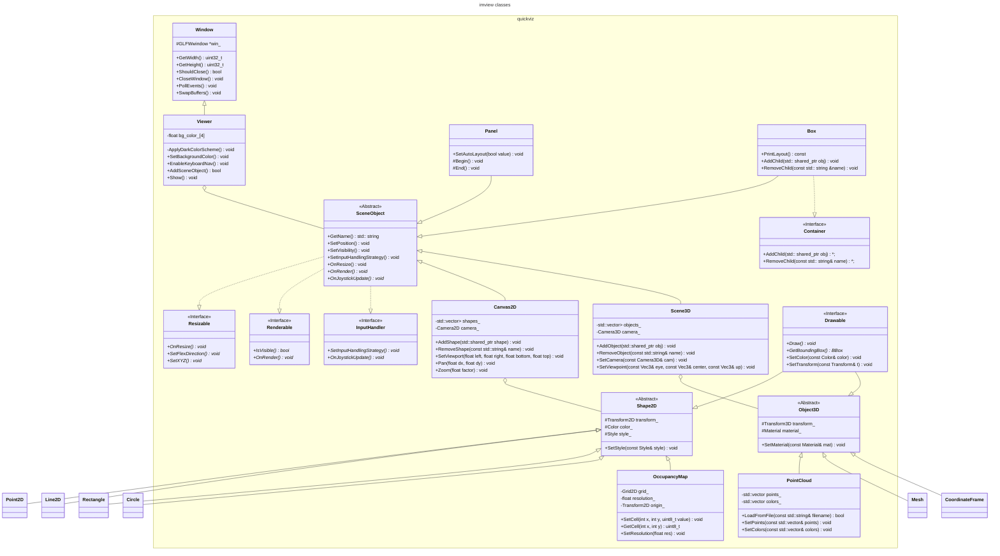

# ImView Design

imview is designed to be a flexible and lightweight framework for 2 types of applications:

* 2D/3D data visualization
* GUI applications

For data visualization, imview provides a set of API functions to easily plot 2D time-series data, draw 2D primitives
and render 3D objects. It can be used to visualize data in real-time.

For GUI applications, imview provides automatic layout management and commonly used UI widgets such as buttons, sliders,
and text boxes.

## Implementation

* **Window management**: imview uses GLFW for window management. GLFW is a lightweight library that provides a simple
  API for creating windows and handling input events. GLFW is cross-platform and supports Windows, macOS, and Linux.
* **Rendering**: imview uses OpenGL for rendering. OpenGL is a low-level graphics API that provides a set of functions
  for rendering 2D and 3D graphics. imview uses modern OpenGL (OpenGL3) for rendering.
* **UI**: imview uses `Dear ImGui`, a lightweight GUI library that provides a simple API for creating UI elements.
* **2D plotting**: imview uses `ImPlot` for 2D plotting. ImPlot is a lightweight plotting library built on top of
  `Dear ImGui`.

The class diagram below shows the main classes in the imview library:



You can refer to the [Mermaid documentation](https://mermaid.js.org/syntax/classDiagram.html) for the syntax of the
class diagrams.

## Use Cases

* If you only need a window and would like to handle everything by yourself, you can use the `Window` class directly.
* If you need a window ready for both OpenGL rendering and UI elements, you can use the `Viewer` class:
    * If no automatic layout is needed, you can define your renderable objects by inheriting from the `SceneObject`
      class and add them to the viewer directly.
    * If you want automatic layout, you can define your renderable objects by inheriting from the `SceneObject`
      class, adding them to the container `Box`, setting layout constraints and adding the containers to the viewer.
      Nesting containers is also supported (i.e. Box inside another Box).
* A specialized type of `SceneObject` is provided for ImGui: `Panel`. You can use this class to create a panel with
  minimal boilerplate code. If automatic layout is enabled (by calling `SetAutoLayout(true)`), the size and
  position of the panel will be automatically adjusted based on the `Box` it is added to.

## Visualization Components

### 2D Rendering
The 2D rendering system is built around the `Canvas2D` class, which serves as a container for 2D shapes and provides viewport management:

* **Basic Shapes**: Point2D, Line2D, Rectangle, Circle - all inherit from Shape2D
* **Complex Visualizations**: OccupancyMap for grid-based data
* **Features**:
  - Coordinate transformation (world to screen)
  - Pan/zoom functionality
  - Style customization (color, line width, fill)
  - Layer management

### 3D Rendering
The 3D visualization is handled by the `Scene3D` class:

* **Core Features**:
  - Camera management
  - Lighting system
  - View manipulation (orbit, pan, zoom)
* **3D Objects**:
  - PointCloud for point cloud visualization
  - Mesh for triangle meshes
  - CoordinateFrame for reference frames
  - Support for custom 3D objects

### Usage Examples

```cpp
// 2D visualization example
auto viewer = std::make_shared<Viewer>();
auto canvas = std::make_shared<Canvas2D>("main_canvas");

// Add some 2D shapes
auto circle = std::make_shared<Circle>(Vec2(0, 0), 1.0);
circle->SetColor(Color(1, 0, 0));  // Red circle
canvas->AddShape(circle);

// Add occupancy map
auto map = std::make_shared<OccupancyMap>(100, 100, 0.05);  // 100x100 cells, 5cm resolution
map->SetCell(50, 50, 255);  // Set occupied cell
canvas->AddShape(map);

viewer->AddSceneObject(canvas);

// 3D visualization example
auto scene = std::make_shared<Scene3D>("main_scene");

// Add point cloud
auto cloud = std::make_shared<PointCloud>();
cloud->LoadFromFile("data.pcd");
cloud->SetColor(Color(0, 1, 0));  // Green points
scene->AddObject(cloud);

viewer->AddSceneObject(scene);
```

## Extension Points

The design supports several extension points:

1. **Custom Shapes**: Create new 2D shapes by inheriting from `Shape2D`
2. **Custom 3D Objects**: Implement new 3D objects by inheriting from `Object3D`
3. **Rendering Styles**: Extend the `Style` and `Material` systems
4. **Input Handling**: Customize interaction by implementing `InputHandler`
5. **Data Sources**: Add new data loading capabilities to existing objects

This architecture provides a balance between ease of use for common visualization tasks and flexibility for extending functionality.