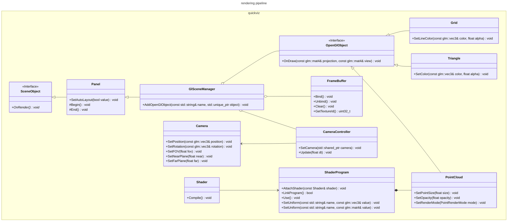

# Renderer Design

For data visualization, the renderer library provides a set of API functions to easily plot 2D time-series data, draw 2D primitives and render 3D objects. It can be used to visualize data in real-time.

## Implementation

The rendering pipeline uses the render-to-texture approach and is built on top of the core components described above.

